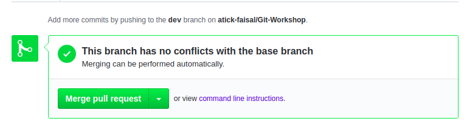

# Workshop on Git and Github  

#### Git 
Git is a version control software that keeps track of file changes and also a tool to use Github.
#### Github
Github is the place to share your work with the world and also collaborate with others.

## Configuring Git (One time process)
After installing Git on your PC run these commands with your name and email. (Right click anywhere in you pc and select "git bash here" option to open the terminal).

```
git config --global user.name "Your_Name"
git config --global user.email "Your_Email"
```

## Creating a Repository
Repositories can be created by goig to github.com and then clicking the `'+'` button on the top right corner. Make sure to check the "Initialize with a Readme" checkbox if you want to add a Readme file.

## Cloning a Repository
To create a local version of the repository you need to clone that to your computer. After clicking the `'Clone or Download'` button copy the repository url. Then run the following command with the url.

```
git clone repository_url
```

## Making changes and commiting them
1. To add all changes to git:

```
git add .
```
Here the '.' indicates that you want to add all modified files. If you want to add a specific file replace that '.' with the filename.

2. To commit changes run with your commit message:
```
git commit -m "Commit message"
```

3. To upload everything to Github run:
```
git push
```

## Pulling from Github
If some changes are made in the github website, you can download those changes to your PC's local repository by running:
```
git pull
```
## Creating a new Branch
```
git checkout -b dev
```
This will create a new branch named `dev` and switch to that branch.
 
To come back to `master` branch run:
```
git checkout master
```

Each branch will have their own version of the repository.

## Merging a branch with master
To Merge a branch with master switch to that branch in Github and create a new `Pull Request`. (Click on the Pull Requests tab if you can't see the option)

You will get something like this:

<p>
 
 <br>
 <p>
  Cick on the compare and Pull Request button above
  </p>
 
</p>

After the pull request is created you can compare and merge that branch with master.

## Adding Collaborators for group project
On Github go to `Settings >> Collaborators` and add collaborators by adding their username or email.

## Contributing
To contribute to a public repository first `Fork` that repository. This will create a copy of that repository to your account. Then you can make changes and create `Pull Reuests` to propose any changes to the owner.

After you made some changes to the forked repository Create a pull request:
<p>
 
 <br>
 <p>
  Cick on the New Pull Request button above
  </p>
 
</p>

Once a pull request is made the owner will receive it.

## Hosting a website
Change the repository name to `your_username.github,io` (The repository must contain a `index.html` file). Your website will be hosted at `your_username.github.io`


## License
[](https://creativecommons.org/licenses/by-nc-sa/4.0)

This work is licensed under [GNU General Public License v3.0](https://github.com/atick-faisal/PIC16F877a/blob/master/LICENSE). 
